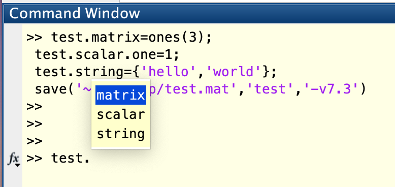

# matHandler
Simple matlab file handle class for python 3.x


corresponding matlab file  



This is a handler for v7.3 matlab file (and might be used for other hdf5 format files, not tested though).

It provides attribute like browsing of matlab structure and simple loading frontend.

## Example

In Matlab

```matlab
test.matrix = ones(3);
test.scalar.one = 1;
test.string = {'hello','world'};
save('~/Desktop/test.mat','test','-v7.3')
```

Then in python

``` python
from matHandler import matHandler
matFile=matHandler('~/Desktop/test.mat');

matrix=matFile.getNum(matFile.name.test.matrix) #use getNum for numbers
scalar=matFile.getNum(matFile.name.test.scalar.one) #nested structures are OK as well
string=matFile.getStr(matFile.name.test.string) #use getStr for strings
```

Then you will get the follwoing

```python
>>> matrix
array([[1., 1., 1.],
       [1., 1., 1.],
       [1., 1., 1.]])

>>> scalar
1.0

>>> string
array(['hello', 'world'], dtype='<U5')
```


## Limination

It doesn't support structure arrays so far.


## Dependencies

h5py  
python-box  
os  
numpy  


